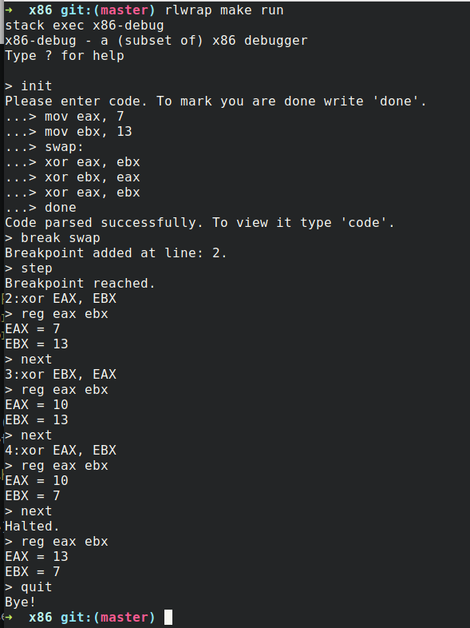

# x86-debug

An emulator/debugger/REPL for a really [small subset](src/Language/X86/Assembly.hs) of x86 assembly.

Though this subset is enough to be a target for [a simple compiler](https://github.com/soupi/nyanpasu).

You can read code from a file/stdin, set break points, step forward and backward, etc.

### Installation:

- You'll need [Stack](https://haskellstack.org)
- Clone the repo
- `make build`
- Wait...
- `make run` to launch the repl

I also suggest using `rlwrap` to get a better REPL experience.

